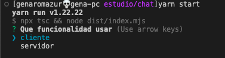

# Chat En vivo

## Descripcion

Se puede elegir entre dos modos, entre proveer el servicio como tambien consumirlo.



Se trata de chat en vivo con encriptacion rsa punta a punta.
Cada cliente se encarga de generar su propia clave privada y la publica se la entregan al servidor para que sea compartida con los demas usuarios conectados.
Cada usuario puede ver el listado de usuarios conectados, enviarles mensajes y ver la bandeja de entrada propia.
Mientras tanto el servidor se encarga de administrar las conexiones y redirigir los mensajes a cada usuario.

[]()

```bash
git clone https://github.com/GenaroMazur/chat-inlive-encription-end-to-end.git
cd chat-inlive-encription-end-to-end
npm i
npm run start
```

## Imagenes

### servidor  

  
  
---

**configuracion de ips**  
  
  
  
---

**listado de usuarios**  
  
  
---

### usuario

  
**listado**  
  

**mensajeria**  
  
  

